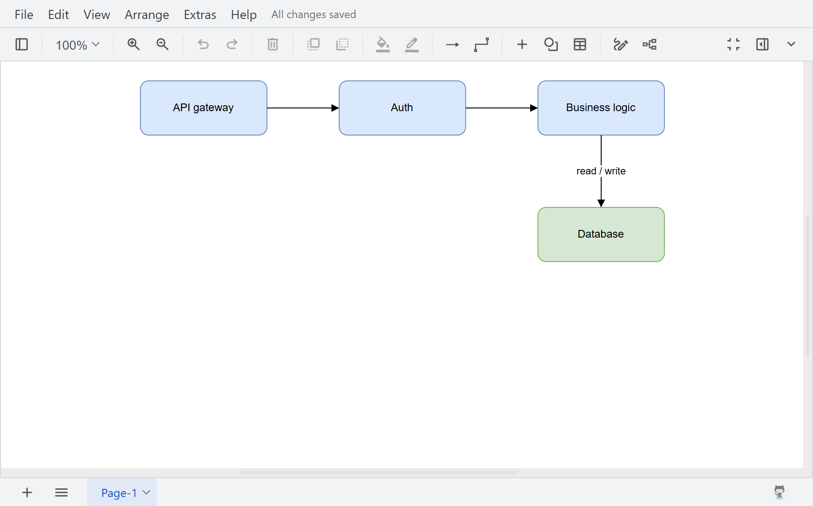

# dsh-drawioedit

English | [中文](README.zh.md)

A plugin for [DeepSeek Harness](https://github.com/deepseek-ai/deepseek-harness) (DSH) that edits `.drawio`
diagrams in the Web Sidebar with the upstream [draw.io](https://github.com/jgraph/drawio) editor. Every edit is
written back to the file the tab opened.



This is the editing companion to [`dsh-drawio`](https://github.com/zhang-guo-wen/dsh-drawio), which previews
`.drawio` files read-only with maxGraph. The two are independent: install either, or both. Rendering here uses
draw.io's own code, so it matches draw.io exactly; the cost is size — about 119 MB against about 1 MB for the
preview.

> Not affiliated with or endorsed by draw.io Ltd. "draw.io" is a trademark of draw.io Ltd. This package embeds their
> Apache-2.0 licensed editor; see [NOTICE](NOTICE).

## What it does

- A `.drawio` file opens in a Sidebar tab running the full upstream editor, labelled with the file's name instead of
  "Untitled Diagram".
- Every edit is written back to the same file: on change (within a second), and on **Ctrl+S**, the toolbar Save
  button, File → Save / Save As, and the editor's own "Unsaved changes. Click here to save." notice.
- The editor boots without contacting any third-party host, so a diagram never leaves the machine.

## Install

The built `lib/` is committed, so nothing builds on your machine; the download carries the bundled editor
(~119 MB). `dsh plugin` adds the dependency and the profile's bundle entry together — do not edit the profile
manifest by hand.

```sh
npx @deepseek-ai/dsh plugin --profile web add git+https://github.com/zhang-guo-wen/dsh-drawioedit.git

# a local checkout is linked, so a rebuilt lib/ reaches the host on the next start
npx @deepseek-ai/dsh plugin --profile web add /absolute/path/to/dsh-drawioedit

# restart the host, then confirm the layer landed
npx @deepseek-ai/dsh web
npx @deepseek-ai/dsh --profile web --dump-config | grep -A2 drawioedit
```

Remove it, dependency and layer together, with
`dsh plugin --profile web remove @guowenzhang/dsh-drawioedit`.

The profile must compose `@deepseek-ai/dsh-client-ui-sidebar-right`, which owns the tab registry this plugin
contributes to. Every shipped web profile does.

## How the editor is driven

The editor is an application, not a component, so it runs in an iframe served from the application origin.
Same-origin is required — a cross-origin parent cannot reach the iframe at all.

**Load.** drawio's bootstrap reads URL parameters from a `#P` hash whose JSON may carry the diagram as a `hash`
field, which it then restores as the real `location.hash` (`#R` + encoded XML):

```
/plugins/dsh-drawioedit/editor/index.html#P{"client":"1","hash":"#R<encoded xml>","dshTitle":"name.drawio"}
```

A bare `#R` hash is ignored, so both layers are required. `dshTitle` carries the file's name for the shim; drawio's
own `title` parameter is not used for that, because drawio percent-decodes it and a file name may contain a percent
sign.

**Read.** The tab's `dsh-resource://file/…` address names the session and the path, and the body reads the file whole
through `workspaceFiles.readBytes(sessionId, path, {}, signal)`. Byte payloads are native on this seam — the Remote
decodes binary fields before the client sees them, so there is nothing to base64-decode — and the result carries the
Host-resolved absolute path and the freshness token that the write later offers as its guard.

**Save.** The shim reports each change as `{event:'autosave', xml}`, and the tab body POSTs it to
`/plugins/dsh-drawioedit/save`. That endpoint writes through `ctx.fs` with the version the read observed as a
freshness guard, so an agent write that landed while the editor was open is refused rather than overwritten. A
confirmed write is sent back into the editor as `{action:'saved'}`, which is what turns drawio's own "Unsaved
changes" notice into "All changes saved".

**Why a shim is needed.** drawio's `#create=` handshake cannot be used from a same-origin iframe — its message
listener returns before doing anything unless `evt.source == (window.opener || window.parent)` (App.js), an identity
check written for the popup window its embed code opens — and the editor keeps its instance in a closure that no
global exposes. The shim therefore intercepts the assignment of `window.EditorUi`, captures the instance with a
forwarding `Proxy`, and owns `ui.saveFile`, the one method every save command funnels into. It is injected at serve
time between `bootstrap.js` and `main.js`, so the vendored editor files stay pristine. This depends on drawio
internals: a drawio upgrade that renames `EditorUi`, `saveFile`, or `getFileData` breaks it, and only
`tests/boot.mjs` notices, because it asserts the editor's end state in a browser. See `src/shim.ts`.

**Cloud integrations stay off.** drawio loads a third-party SDK for each of its cloud integrations unless told
otherwise; every one of them is switched off by name in `src/params.ts`. The `offline` suite fails if any remote
host is contacted while the editor boots.

## Tests

`npm test` runs eight keyless suites. Two of them drive a real headless Chrome, which they look for at their
platform's default location; set `CHROME_PATH` to a Chrome or Chromium executable if it is installed elsewhere.

| Suite | What it proves |
|---|---|
| `artifact` | both committed bundles are at least as new as their sources |
| `smoke` | the built client bundle loads with a module table holding only `react`, registers its tab type and body, and reads a diagram through the Client Remote's `readBytes` |
| `serve` | the editor route serves real files, rejects traversal, and injects the shim in the right place |
| `save` | the save endpoint guards writes with `replaceIfVersion` and refuses malformed requests |
| `shim` | the shim parses, hooks the editor class, captures an instance, reports edits, and owns the save funnel |
| `shimdelivery` | the shim reaches the editor through the plugin route, before the script that defines it |
| `boot` | the editor boots to its canvas, draws the diagram, reports it, names it, and opens a menu at its menu bar |
| `offline` | the editor boots having contacted no remote host, and every asset it asks for exists |

`offline`'s asset assertion earns its place: `editor/mxgraph/css/common.css` is the only declaration of
`div.mxPopupMenu { position: absolute }`, and the editor boots without it — the menus simply flow below the toolbar —
so the 4xx assertion is what catches a missing asset. `tests/debug/` holds browser-driving and bundle-scanning tools
used while developing the embed protocol; they are not part of the suite, and `scan-assets.mjs` is deliberately noisy.

## Diagnostics

Open the editor frame in DevTools and read `window.__dshShimState`:

| Field | Meaning |
|---|---|
| `revision` | which shim the browser is running; it is host-half code, so this catches a stale host |
| `hooked` / `installs` | the class was intercepted and an instance captured (`installs` ≥ 1) |
| `reports` | the editor read the diagram and reported it — an edit or a save |
| `saved` | the host confirmed a write; without it drawio keeps saying "Unsaved changes" |
| `keys` | the Ctrl+S safety net saw the key |
| `errors` / `lastError` | reading the diagram threw, which every caller would otherwise swallow as "nothing changed" |
| `saveFileOwned` | the shim owns the save funnel; it must be `true` |
| `rebound` | what the shim patched: `save`, `saveAs`, `saveFile`, `mxUtils.fit` |

## Build

```sh
npm install
npm run build      # host half via tsdown, browser half via build-client.mjs
npm run typecheck  # tsc against the PUBLISHED @deepseek-ai/* packages
npm test           # eight keyless suites, two of which drive a browser
```

`typecheck` covers this package's own sources. It does not cover the Client Remote's method set: the namespaces are
generated and assembled by the harness at runtime, and this package does not install the gateway that declares them,
so `ctx.remote` checks as unconstrained. `tests/smoke.mjs` holds that edge instead — it drives the body's read against
a Remote fake shaped like the generated namespace, so a method the namespace does not carry fails the suite.

The plugin is two halves that update differently: the client bundle (`lib/client.js`) is hot-swapped, or needs a
page refresh; the host half (`lib/index.mjs`) carries the editor route, the save endpoint, and the shim source, and
needs a `dsh web` restart. Editing `src/shim.ts` therefore changes nothing until the host restarts. `src/` is small
enough to read directly: `index.ts`
and `serve.ts` (routing and shim injection), `save.ts` (the version-guarded write), `params.ts` (the editor URL),
and `client/` (the tab type, the iframe body, the transports).

The harness monorepo builds its client bundles with a script it does not publish, so this repository bundles the
browser half itself. `platform: 'browser'` is stated explicitly: under rolldown's `node` platform a dependency
whose `exports` lists a platform condition before `import` gets its server entry inlined, and that entry can
`require("module")` at module scope — a specifier the browser module table cannot answer.

`editor/` is trimmed from the upstream webapp by dropping `WEB-INF/` (Java jars), `js/integrate.min.js`, the service
worker, and the legacy unminified `mxgraph/src` sources — 148.6 MB down to 119.0 MB. `mxgraph/css/common.css` is
kept, for the reason above.

## License

Apache-2.0. The bundled editor is Apache-2.0 with additional terms on its icon sets and stencil libraries; see
[NOTICE](NOTICE).
