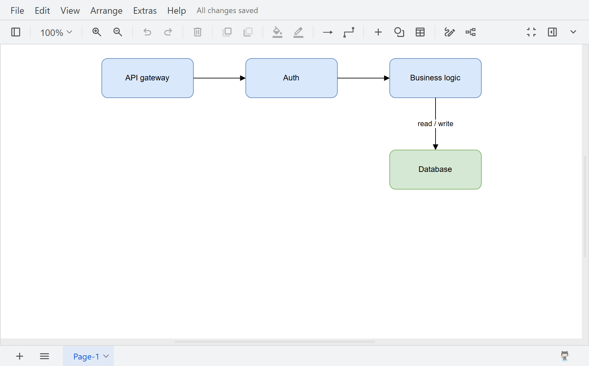

# dsh-drawioedit

[English](README.md) | 中文

在 DeepSeek Harness Web 侧栏使用随包提供的离线 draw.io 编辑器编辑 `.drawio` 文件。



## 安装

```sh
npx @deepseek-ai/dsh plugin --profile web add @guowenzhang/dsh-drawioedit
```

安装后重启宿主。

## 功能

- 从文件树打开 `.drawio` 文件，在侧栏标签页编辑；中文文件名可正常显示。
- 通过宿主文件服务自动保存，遵循当前会话的工作区权限；保存失败或文件冲突会在标签页提示。
- **Save As** 在原目录重命名文件；**Export as** 下载副本。

## 图形与包体积

保留通用与基本图形、箭头、流程图、ER、UML、BPMN、DFD、C4，以及自由绘图和草图样式。云厂商、网络设备等专业图形库未随包提供；依赖它们的图表可能显示异常。

本地包**压缩后约 12.1 MB，解包后约 42.7 MiB**（`npm pack --dry-run`）；已发布版本可能不同。

云端集成已关闭，启动时不会加载第三方服务。

## 许可

Apache-2.0。随包编辑器的附加条款见 [NOTICE](NOTICE)。本项目与 draw.io Ltd 无从属关系。构建与排查见 [AGENTS.md](AGENTS.md)。
